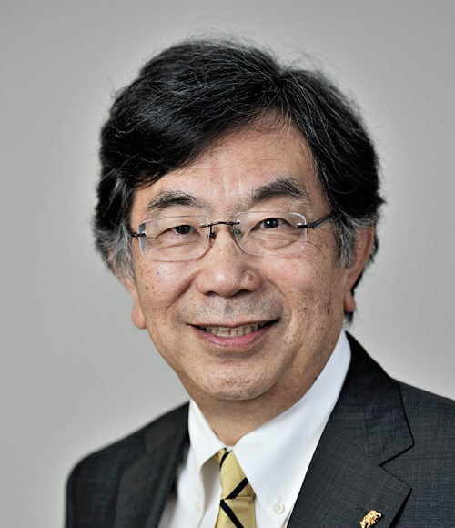

### Etcheverry Office:
5100B Etcheverry Hall

(510) 642-0870

### McLaughlin Office:
209 McLaughlin Hall

(510) 643-1666

[Email](mailto:tomizuka@me.berkeley.edu)

[Official Website](http://www.me.berkeley.edu/faculty/tomizuka/)

[Wikipedia article](http://en.wikipedia.org/wiki/Masayoshi_Tomizuka)

<button style="display: block; width: 100%;" data-toggle="collapse" data-target="#bio">Biography</button>

### Biography
Masayoshi Tomizuka received his B.S. and M.S. from Keio University in 1968 and 1970, respectively. He received his Ph. D. from MIT in 1974, after which he joined the ME Department at UC Berkeley. Here, he served as the Vice Chair of Instruction from Dec. 1989 to Dec. 1991, and as the Vice Chair of graduate studies from Jul. 1995 to Dec. 1996.

He is currently the Associate Dean of Academic Affairs for the College of Engineering at UC Berkeley. From 2009 to 2011, he was the Executive Associate Dean for the College of Engineering at UC Berkeley. He also served as Program Director of the Dynamic Systems and Control Program at the National Science Foundation from Sept. 2002 to Dec. 2004.

Prof. Tomizuka's research interests include optimal and adaptive control, digital control, signal processing, motion control, mechatronics and their applications in robotics, manufacturing, data storage devices, vehicles, and human-machine systems.

<button style="display: block; width: 100%;" data-toggle="collapse" data-target="#courses">Courses</button>

### Courses

Prof. Tomizuka's Courses
Courses currently or previously taught by Prof. Tomizuka.

#### ME 132 - Dynamic Systems and Feedback
Physical understanding of dynamics and feedback. Linear feedback control of dynamic systems. Mathematical tools for analysis and design. Stability. Modeling systems with differential equations. Linearization. Solution to linear, time-invariant differential equations.

#### ME 134 - Feedback Control Systems
Analysis and synthesis of linear feedback control systems in transform and time domains. Control system design by root locus, frequency response, and state space methods. Applications to electro-mechanical and mechatronics systems.

#### ME 232 - Advanced Control Systems I
Input-output and state space representation of linear continuous and discrete time dynamic systems. Controllability, observability, and stability. Modeling and identification. Design and analysis of single and multi-variable feedback control systems in transform and time domain. State observer. Feedforward/preview control. Application to engineering systems.

#### ME 233 - Advanced Control Systems II
Linear Quadratic Optimal Control, Stochastic State Estimation, Linear Quadratic Gaussian Problem, Loop Transfer Recovery, Adaptive Control and Model Reference Adaptive Systems, Self Tuning Regulators, Repetitive Control, Application to engineering systems.

#### ME 290Z - Topics in Control, Modeling and Optimization
Iterative learning control.

